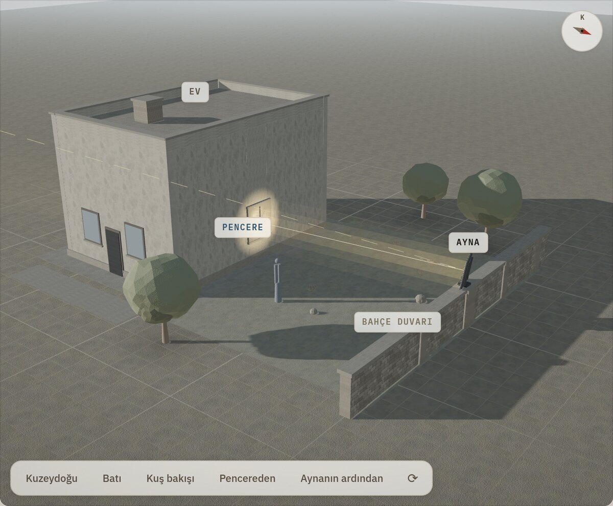
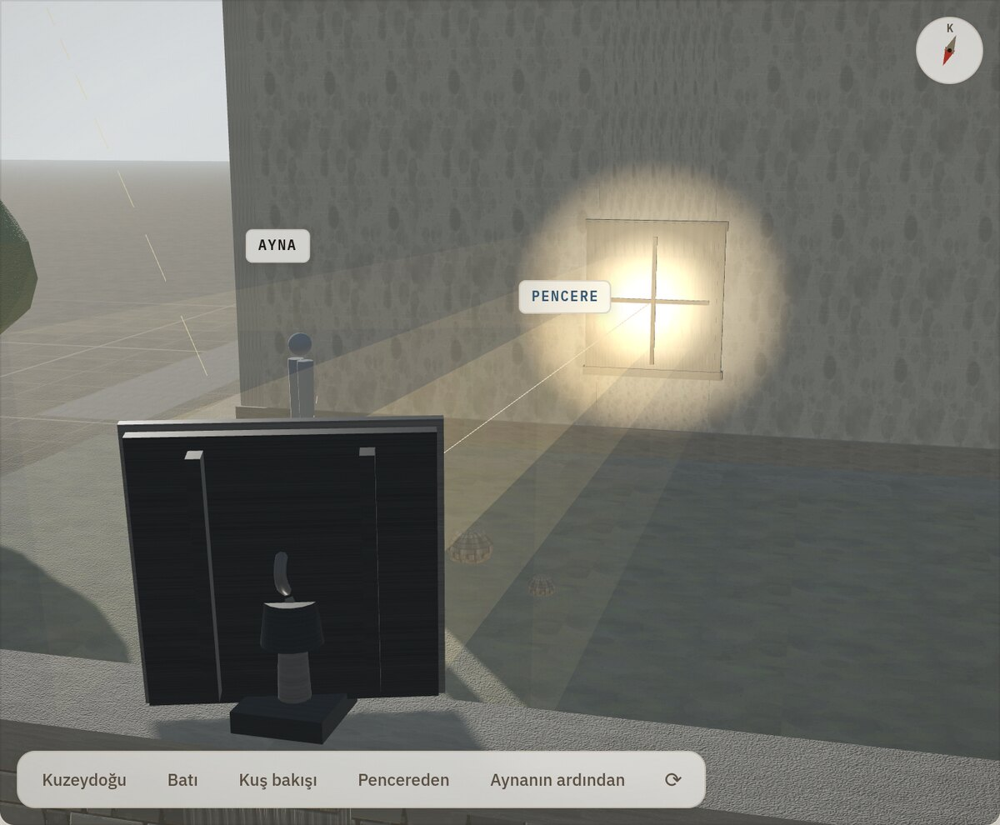

# Kuzey Işık Heliostatı

Kuzeye bakan bir pencere hiç doğrudan güneş görmez. Bu proje, evin 10 m kuzeyindeki bahçe
duvarına kurulan hareketli bir aynayla gün boyunca o pencereye güneş ışığı taşır:
**Ürgüp (Nevşehir)** için hesaplanmış geometri, tarayıcıda çalışan etkileşimli bir simülasyon,
DS3231 + iki servo ile çalışan Arduino kodu ve bunların hepsini doğrulayan bağımsız Python
hesapları.



> **Güvenlik:** Aynadan yansıyan ışık seyreltilmiş değildir. Aynaya doğrudan bakmak güneşe
> bakmakla aynı şeydir ve odaya giren ~700 W ciddi bir ısı yüküdür.
> Kurmadan önce [Güvenlik](#15-güvenlik) bölümünü okuyun.

| | |
|---|---|
| Konum | Ürgüp / Nevşehir · 38.6317° K, 34.9128° D · 1043 m · UTC+3 (yaz saati yok) |
| Geometri | Ayna duvarda 2.20 m, pencere cephede 1.80 m, aradaki mesafe 10.0 m |
| Kontrol | Açık döngü: DS3231 saat + NOAA güneş konumu + bisektör kuralı |
| Donanım | Arduino Nano/Uno · DS3231 · 2 × metal dişli servo · 3:1 redüktör · 1 m² cam ayna |
| Kazanç | Kışın 9.3 saat, ortalama %93 kosinüs verimi, tepe 705 W |

---

## İçindekiler

1. [Sorun](#1-sorun)
2. [Temel kural: bisektör](#2-temel-kural-bisektör)
3. [Hızlı başlangıç](#3-hızlı-başlangıç)
4. [Simülasyon](#4-simülasyon)
5. [Aynayı nereye çevirmeli? Altı yöntem](#5-aynayı-nereye-çevirmeli-altı-yöntem)
6. [Tek motorla olur mu?](#6-tek-motorla-olur-mu)
7. [Yıl boyunca](#7-yıl-boyunca)
8. [Hata bütçesi: neden redüktör şart?](#8-hata-bütçesi-neden-redüktör-şart)
9. [Donanım](#9-donanım)
10. [Kurulum ve kalibrasyon](#10-kurulum-ve-kalibrasyon)
11. [Firmware](#11-firmware)
12. [Python referans hesapları](#12-python-referans-hesapları)
13. [Doğrulama](#13-doğrulama)
14. [Depo yapısı](#14-depo-yapısı)
15. [Güvenlik](#15-güvenlik)
16. [Sorun giderme](#16-sorun-giderme)
17. [Bilinen sınırlar](#17-bilinen-sınırlar)
18. [Lisans](#18-lisans)

---

## 1. Sorun

Evin kuzey cephesi yılın hiçbir günü doğrudan güneş almaz. Ürgüp enleminde (38.6° K) güneş
kışın güneydoğudan doğup güneybatıdan batar; yazın kuzeydoğudan doğup kuzeybatıdan batsa
bile cepheye ancak sabahın ve akşamın birkaç dakikası için yalar geçer.

Cepheden 10 m kuzeydeki bahçe duvarına konan bir ayna, gün boyunca dönerek güneşi sürekli
aynı pencereye yansıtırsa bu sorun çözülür. İşin tamamı tek bir kuralı doğru uygulamaya bakar.

## 2. Temel kural: bisektör

Ayna normali, güneş yönü ile hedef yönünün **tam ortasını** bölmelidir:

```
s = aynadan GÜNEŞE bakan birim vektör    (gün boyunca değişir)
t = aynadan PENCEREYE bakan birim vektör (sabit)

n = normalize(s + t)
```

Bu kadar. Geri kalan her şey bu üç satırın etrafındaki mühendisliktir.

İki sonucu hemen not etmek gerekir:

- **Aynayı güneşe doğrultmak yanlıştır.** `n = s` yaparsanız ışık geldiği yere, yani güneşe
  geri gider. Güneş paneli için doğru olan bu kural, heliostat için tamamen yanlıştır.
- **Ayna, güneşin yarısı kadar döner.** Güneş gökyüzünde 15°/saat ilerler; ayna normali bu
  geometride 6.4–10.9°/saat döner. Klasik heliostat literatüründeki "tam 7.5°/saat" değeri
  yalnızca hedef kutup ekseni doğrultusundayken geçerlidir — burada değil (bkz.
  [Tek motorla olur mu?](#6-tek-motorla-olur-mu)).

Koordinat sistemi her yerde aynıdır: **ENU**, yani `x = Doğu`, `y = Kuzey`, `z = Yukarı`.
Azimut kuzeyden saat yönünde ölçülür (K = 0°, D = 90°, G = 180°, B = 270°). Orijin, kuzey
cephesinin dibinde, pencere ortasının tam altındadır.

## 3. Hızlı başlangıç

**Simülasyonu aç** — kurulum yok, sunucu gerekmez:

```bash
xdg-open kuzey-isik-heliostat/docs/index.html
```

**Referans hesapları çalıştır** — `noaa.py`, `heliostat.py` ve `modes.py` yalnızca standart
kütüphane kullanır:

```bash
cd kuzey-isik-heliostat/tools && python3 heliostat.py
```

**Firmware'i derle** — `arduino-cli` ile (Arduino IDE'de de açılır):

```bash
arduino-cli core install arduino:avr && arduino-cli lib install RTClib Servo
arduino-cli compile --fqbn arduino:avr:nano kuzey-isik-heliostat/firmware/kuzey_isik_heliostat
```

## 4. Simülasyon

`kuzey-isik-heliostat/docs/index.html` tek bir dosyadır (≈256 KB) ve yanındaki
`three.min.js` dışında hiçbir bağımlılığı yoktur. Çevrimdışı çalışır; internet yalnızca
yazı tiplerini Google Fonts'tan çekmek için kullanılır, erişilemezse sistem yazı tipine düşer.
WebGL yoksa 3B sahne kendiliğinden 2B izometrik çizime döner.


### Ne gösteriyor

- **Döndürülebilir 3B genel görünüm** — gerçek gölgeler, yansıyan ışık hüzmesi, kamera ön
  ayarları; ayrıca birbirine bağlı üç teknik çizim: **kuş bakışı vaziyet planı**,
  **düşey kesit** ve **kuzey cephesi**
- **Şimdi** düğmesiyle Türkiye saatine kilitli canlı takip (sayfa bu modda açılır; gece
  açıldıysa kendiliğinden o günün güneş öğlesine geçip nedenini söyler)
- Anlık servo açıları (PAN / TILT), geliş açısı, kosinüs verimi, pencereye giren güç,
  hedeften sapma — her birinin ne anlama geldiği panonun altındaki sözlükte
- Evin ve duvarın aynayı ne zaman gölgelediği
- Işık lekesinin cephede tam olarak nereye düştüğü, pencereyi tutturup tutturmadığı
- Altı farklı yönlendirme yöntemini yan yana karşılaştırma
- Geometriyi değiştirebileceğiniz kaydırıcılar: duvar mesafesi, ayna ve pencere yüksekliği,
  ev boyutları, ayna kenarı, doğu–batı kayıklığı, servo açı hatası

### Kumandalar

| Kısayol | Ne yapar |
|---|---|
| `Boşluk` | Günü oynat / durdur (gece atlanır) |
| `←` / `→` | ±10 dakika |
| `Shift` + `←` / `→` | ±1 saat |
| `↑` / `↓` | ±1 gün |
| `Shift` + `↑` / `↓` | ±10 gün |
| `N` | Canlı saate dön |
| Grafikte tıklama | Simülasyonu o saate al |

3B sahnede: sürükle döndürür, sağ tuşla sürükle kaydırır, çift tık kamerayı sıfırlar.
Tekerlek yakınlaştırır ama **önce sahneye tıklamış olmanız** ya da `Ctrl` basılı tutmanız
gerekir — böylece sayfayı kaydırırken fare sahnenin üstünden geçtiğinde kaza olmaz.

### Paylaşılabilir bağlantı

**Bağlantı** düğmesi o anki durumu adres satırına yazar. Bağlantıyı açan kişi tam olarak
sizin gördüğünüz anı görür.

| Parametre | Anlamı | Örnek |
|---|---|---|
| `g` | Yılın günü (1–365) | `g=355` → 21 Aralık |
| `t` | Günün dakikası (0–1439) | `t=600` → 10:00 |
| `m` | Yöntem: `bisektor`, `tekeksen`, `ldr`, `panonly`, `sabit`, `gunes` | `m=gunes` |
| `D` | Duvar mesafesi (m) | `D=12` |
| `mz` / `wz` | Ayna / pencere merkezi yüksekliği (m) | `mz=2.4` |
| `hh` / `hw` | Ev saçak yüksekliği / genişliği (m) | `hh=7` |
| `ms` | Ayna kenarı (m) | `ms=1.2` |
| `mx` | Aynanın doğu–batı kayıklığı (m) | `mx=-1.5` |
| `wh` | Bahçe duvarı yüksekliği (m) | `wh=3` |
| `ns` | Servo açı hatası, RMS (°) | `ns=0.5` |

Örnek: [`?g=355&t=600&m=gunes`](kuzey-isik-heliostat/docs/index.html?g=355&t=600&m=gunes) —
21 Aralık saat 10:00'da, aynayı güneşe doğrultursanız ışığın nereye gittiğini gösterir.

## 5. Aynayı nereye çevirmeli? Altı yöntem

21 Aralık, aynı geometri, 10 dakikalık adımlarla gün boyu. "İsabet", lekenin merkezinin
1.2 × 1.4 m'lik pencere açıklığı içinde kaldığı zamanın oranıdır.


| Yöntem | Motor | İsabet | Ort. sapma | Sonuç |
|---|---|---:|---:|---|
| **Bisektör** `n = normalize(s + t)` | 2 servo | %100 | 0.06 m | Doğru yöntem |
| Tek eksen, sabit hız | 1 motor | %100 | 0.06 m | Gün içinde yeter, mevsimlik ayar ister |
| LDR kapalı döngü | 2 servo + 4 LDR | %100 | 0.19 m | Titrer; yalnızca ince ayar olarak |
| Sadece PAN döner | 1 servo | %38 | 1.57 m | Leke dikeyde kayar |
| Sabit ayna | — | %5 | 6.56 m | Günde birkaç dakika |
| Güneş takibi `n = s` | 2 servo | %0 | 8.71 m | Işığı güneşe geri yollar |

**Hedefe hizalı montaj** (birincil ekseni doğrudan pencereye bakan mekanik) optik olarak
bisektörle birebir aynı sonucu verir; farkı yalnızca mekaniktedir ve bu ölçekte bir avantajı
yoktur. Alt-azimut montajda PAN gün boyu yalnızca 59°, TILT 14° hareket eder.

## 6. Tek motorla olur mu?

Olur, ama klasik reçeteyle değil. Tarihsel heliostatların kuralı "ekseni kutup eksenine
hizala, tam 7.5°/saat döndür"dür. Bu yalnızca hedef kutup ekseni doğrultusundayken çalışır.
Burada hedef 10 m kuzeydeki bir pencere, dolayısıyla reçete tutmaz:

| Senaryo | Ort. hata | Maks hata | Pencereye sığar mı? |
|---|---:|---:|---|
| Kutup ekseni + tam 7.5°/sa (klasik) | 0.84–1.30 m | 1.85–2.76 m | Hayır |
| Kutup ekseni + en iyi hız | 0.31–0.61 m | 0.60–1.52 m | Hayır |
| **Optimize edilmiş tek eksen** (güne özel) | 0.04–0.20 m | 0.14–0.24 m | **Evet** |

Optimize edilmiş eksen, kutup ekseninden yalnızca 9–15° sapar: fikir doğru, sabitler farklı.
Bulunan değerler ekinoksta azimut ≈ 180°, yükselti ≈ −26°, hız ≈ 11°/saat.

Tek bir sabit geometriyle (azimut 180°, yükselti −26.5°, 10.9°/saat) ve yalnızca günlük
sıfırlamayla yılın büyük kısmı kurtarılır: ekinokslarda hata 0.2 m'de kalır, gündönümlerinde
0.7–0.95 m'ye çıkar. Yani ayda bir eksen açısını elle düzeltmek gerekir — tarihsel
heliostatlardaki "deklinasyon ayarı" tam olarak budur. Hesabın tamamı `tools/single_axis.py`
içinde.

## 7. Yıl boyunca

Varsayılan geometride (10 m mesafe, ayna 2.20 m, pencere 1.80 m, 1 m² ayna, %90 yansıtma,
açık gökyüzü):

| Tarih | Öğlen güneş yük. | Ayna ışık alır | Süre | Ort. verim | Tepe güç | PAN aralığı | TILT aralığı |
|---|---:|---|---:|---:|---:|---:|---:|
| 21 Aralık | 28.0° | 08:00 – 17:10 | 9.3 sa | %93.2 | 705 W | 150–209° | −1–13° |
| 21 Ocak | 31.5° | 08:00 – 17:40 | 9.8 sa | %91.8 | 729 W | 148–212° | −1–15° |
| 21 Şubat | 40.9° | 07:30 – 18:20 | 11.0 sa | %87.9 | 766 W | 142–218° | −1–19° |
| 21 Mart | 51.7° | 07:00 – 18:30 | 11.7 sa | %83.0 | 775 W | 136–224° | 0–25° |
| 21 Nisan | 63.3° | 07:50 – 17:20 | 9.7 sa | %79.6 | 758 W | 138–222° | 13–31° |
| 21 Mayıs | 71.6° | 08:40 – 16:30 | 8.0 sa | %76.8 | 732 W | 142–218° | 23–35° |
| 21 Haziran | 74.8° | 09:10 – 16:20 | 7.3 sa | %75.6 | 719 W | 145–216° | 26–36° |

Sistem **kışın en verimli** — ışığa en çok o zaman ihtiyaç duyulur. Güneş alçakta olduğu için
geliş açısı küçülür, kosinüs verimi %93'e çıkar. Yazın duvarın kendisi sabah ve akşam aynayı
gölgeler, çünkü güneş kuzeydoğudan doğup kuzeybatıdan batar.

Güç değerleri açık gökyüzü doğrudan ışınım modeliyle ve %90 yansıtmalı 1 m² gümüş ayna
varsayımıyla hesaplanır. **Camın geçirgenliği dahil değildir**; tek cam için odaya giren güç
yaklaşık %85'i kadardır.

## 8. Hata bütçesi: neden redüktör şart?

Aynadaki **1° hata ışını 2° saptırır** → 10 m'de **35 cm** kayma. 1.2 m genişliğindeki bir
pencere ve ~1.1 m'lik leke için toplam hata bütçesi yaklaşık **0.3°**'dir.

| Kaynak | Aynadaki hata | Pencerede karşılığı |
|---|---:|---:|
| Doğrudan sürülen standart servo | ~1.0° | 35 cm — **yetersiz** |
| 3:1 redüktör + `writeMicroseconds` | ~0.2° | 7 cm — iyi |
| 60 sn'lik güncelleme periyodu | 0.11–0.18° | 4–6 cm |
| Güneş konumu hesabı (float32, J2000) | 0.0002° | < 0.1 mm |
| RTC sapması (DS3231, ±2 ppm, 1 yıl) | ~0.06° | ~2 cm |
| RTC sapması (DS1307, ayda 5 dk) | ~0.6° | ~21 cm |

Güneş nokta kaynak olmadığı için (0.53° açısal çap) leke, 10 m'de aynadan **her yönde 9 cm**
büyür: 1 m'lik ayna → 1.09 m'lik leke. Ayna büyütmek lekeyi odaklamaz, büyütür. Daha çok ışık
isterseniz doğru yol ikinci bir ayna eklemektir.

## 9. Donanım

| Parça | Seçim | Neden |
|---|---|---|
| Kontrolcü | Arduino Nano / Uno (veya ESP32) | AVR'nin 32-bit float'ı bu hesap için yeterli — bkz. `tools/float32_check.py` |
| Saat | DS3231 + CR2032 | ±2 ppm, yılda ~1 dakika. **DS1307 kullanmayın**: ayda 5 dakika kayar |
| Motor | 2 × DS3218 / MG996R (metal dişli) | 1 m² ayna rüzgârda ciddi moment üretir; SG90 bu iş için oyuncak |
| **Redüktör** | **3:1 – 4:1** (kayış veya sonsuz vida) | **Projenin en kritik parçası** — bkz. [Hata bütçesi](#8-hata-bütçesi-neden-redüktör-şart) |
| Besleme | 6 V / 5 A anahtarlamalı + 1000 µF | MG996R kalkışta ~2.5 A çeker; servoları Arduino'dan beslemeyin |
| Ayna | 4 mm gümüş cam, alüminyum çerçeve | %90–95 yansıtır ve yıllarca bozulmaz; akrilik 1–2 yılda matlaşır ve bombeleşir |
| Mekanik | Duvar üstünde direk + kalın ayak payandası | Aşağıya bakın |
| İsteğe bağlı | Rüzgâr sensörü / limit switch | 50 km/sa üstünde aynayı park konumuna alıp yükü düşürmek için |

### Bağlantı

```
Arduino Nano/Uno                    DS3231
  A4 (SDA) ───────────────────────── SDA
  A5 (SCL) ───────────────────────── SCL
  5V ─────────────────────────────── VCC
  GND ────────────────────────────── GND

  D9  ──────── PAN servo  sinyal (turuncu)
  D10 ──────── TILT servo sinyal (turuncu)

  6 V / 5 A ──┬── servo V+ (kırmızı)   ── 1000 µF servo hattına
              └── ortak GND (kahve) ───── Arduino GND
```

Servo beslemesinin GND'si Arduino GND'si ile **mutlaka** birleştirilmelidir; yoksa sinyal
referansı oluşmaz. Ortak GND yoksa servolar rastgele davranır.

### Ayna montajı



Ayna daima **kendi merkezinin altındaki** bir direğe oturur. Dönme ekseni direğin ekseniyle
çakıştığı için ayna PAN'da 360° dönse bile hiçbir yere çarpmaz. Simülasyon iki durumu ayırır:

- **Ayna duvarın üstündeyse** (varsayılan: merkez 2.20 m, 1 m ayna, 1.5 m duvar → alt kenar
  harpuştanın 7 cm üstünde) direk harpuştadan çıkar, altına kalın bir ayak payandası gelir.
- **Duvar aynaya kadar yükseliyorsa** direk zeminden beton pabuçla yükselir ve iki konsolla
  duvara ankrajlanır; duvar 70 cm kuzeye alınır. Ayna hiçbir durumda duvarın içine girmez.

Aynanın alt kenarı ile harpuşta arasında en az 6 cm boşluk bırakın. TILT yazın 36°'ye kadar
çıktığı için 1 m aynanın alt kenarı geriye doğru salınır; konsol derinliğini buna göre seçin.

**Rüzgâr:** 1 m² düz levha 100 km/sa rüzgârda yaklaşık 0.5 kPa basınç, yani ~500 N kuvvet
görür. Konsol, direk ve servo dişlisi bunu *statik* olarak karşılamalıdır. Servo tutamıyorsa
aynayı düz konuma alan mekanik bir kilit düşünün.

## 10. Kurulum ve kalibrasyon

**Adım 1 — Ölç.** Ayna ve pencere merkezinin birbirine göre konumunu üç eksende şeritmetreyle
ölçün. Bunlar firmware'deki `MX/MY/MZ` ve `WX/WY/WZ` değerleridir. Aynanın doğu–batı
kayıklığını (`MX`) unutmayın; simülasyondaki karşılığı `mx` kaydırıcısıdır.

**Adım 2 — Kuzeyi bul.** Sistemin tek zayıf noktası azimut sıfırıdır. Pusula **manyetik**
kuzeyi gösterir; Ürgüp'te sapma yaklaşık **+6° doğuya**. Daha güvenilir yöntem: öğlen
saatlerinde düşey bir çubuğun gölgesini izleyin, gölgenin en kısa olduğu an tam kuzey–güney
doğrultusunu verir.

**Adım 3 — Kalibre et.** Seri porttan `u1000` ve `u2000` yazıp **aynanın** gerçek açısını
dijital açıölçerle ölçün, iki noktayı `PAN` yapısına girin; `v` komutuyla aynısını TILT için
yapın. Redüktör kullanıyorsanız ölçümü ayna üzerinde yaptığınız için oran kalibrasyona
kendiliğinden gömülür, ayrıca girmenize gerek yoktur.

> Kalibrasyon sırasında dikkat: ana döngü **60 saniyede bir** hesabı tekrarlayıp servolara
> yazar, yani elle verdiğiniz konum en geç bir dakika içinde ezilir. Ölçümü hemen yapın ya da
> kalibrasyon süresince `PERIOD` değerini geçici olarak büyütün.

**Adım 4 — Doğrula.** Açık bir öğle vakti çalıştırın. Leke pencerenin sağına veya soluna
kaçıyorsa kuzey referansı, altına veya üstüne kaçıyorsa TILT kalibrasyonu hatalıdır. Kayma
miktarının yarısı, derece cinsinden aynanın hatasıdır: 10 m'de 35 cm kayma = 0.5° ayna hatası.

## 11. Firmware

`kuzey-isik-heliostat/firmware/kuzey_isik_heliostat/kuzey_isik_heliostat.ino` — tek dosya,
264 satır, harici kütüphane olarak yalnızca RTClib ve Servo.

Çalışma mantığı açık döngüdür: saat DS3231'den okunur, güneşin konumu NOAA algoritmasıyla
**hesaplanır**, bisektör bulunur ve servolara yazılır. Sistem güneşi aramaz, nerede olduğunu
bilir; bu yüzden bulut geçse de, aynaya gölge düşse de şaşmaz.

Her turda dört kontrol yapılır ve biri bile geçmezse ayna park konumuna alınır:
güneş `MIN_SUN_ALT`'ın üstünde mi · güneş duvarın arkasında mı · ev aynayı gölgeliyor mu ·
hesaplanan açılar yumuşak limitlerin içinde mi.

### Ayarlanacak sabitler

| Sabit | Varsayılan | Ne işe yarar |
|---|---|---|
| `LAT` / `LON` | 38.6317 / 34.9128 | Konum (+ kuzey / + doğu) |
| `TZ` | 3.0 | Saat dilimi; Türkiye'de yaz saati yok |
| `MX, MY, MZ` | 0.00, 10.00, 2.20 | Ayna merkezi (m) |
| `WX, WY, WZ` | 0.00, 0.00, 1.80 | Pencere merkezi (m) |
| `PIN_PAN` / `PIN_TILT` | 9 / 10 | Servo sinyal pinleri |
| `PAN` | 135°→1000 µs, 225°→2000 µs, limit 120–245° | İki noktalı kalibrasyon + yumuşak limit |
| `TILT` | 0°→1200 µs, 45°→1900 µs, limit −5–45° | Aynı |
| `MIN_SUN_ALT` | 3.0° | Bu yükseltinin altında çalışma |
| `DEADBAND` | 0.05° | Bu kadar küçük değişimde servoya dokunma |
| `PERIOD` | 60000 ms | Güncelleme periyodu |
| `PARK_PAN` / `PARK_TILT` | 180° / −5° | Gece ve engel durumundaki park konumu |
| `HOUSE_SHADOW_CHECK` | true | Ev gölgesi kontrolü açık |
| `HOUSE_H` / `HOUSE_W` | 6.0 / 10.0 m | Evin saçak yüksekliği ve genişliği |

Yumuşak limitleri (`PAN.minA` / `maxA`) **mutlaka** kendi sahanıza göre ayarlayın. Bir yazılım
hatasında ışın komşunun penceresine ya da yola gitmemelidir.

### Seri port komutları

115200 baud. Satır sonu bekler.

| Komut | Örnek | Ne yapar |
|---|---|---|
| `p<açı>` | `p172.5` | PAN eksenini bu açıya sür |
| `t<açı>` | `t12.8` | TILT eksenini bu açıya sür |
| `u<µs>` | `u1480` | PAN servosuna ham mikrosaniye yaz (kalibrasyon) |
| `v<µs>` | `v1600` | TILT servosuna ham mikrosaniye yaz |
| `k` | `k` | Park konumuna al |
| `s<...>` | `s2026,09,15,14,30,00` | RTC saatini yaz (YYYY,MM,DD,hh,mm,ss) |

Çalışırken her turda seri porta şu satır düşer:
`14:30  gunes 54.14/164.40  ayna 174.25/26.12  gelis 28.9  verim %88`

### Derleme

Arduino IDE'de doğrudan açılır. Komut satırında:

```bash
arduino-cli core install arduino:avr
arduino-cli lib install RTClib Servo
arduino-cli compile --fqbn arduino:avr:nano kuzey-isik-heliostat/firmware/kuzey_isik_heliostat
arduino-cli upload  --fqbn arduino:avr:nano -p /dev/ttyUSB0 kuzey-isik-heliostat/firmware/kuzey_isik_heliostat
```

`Servo` kütüphanesi `arduino-cli` ile **kendiliğinden gelmez**, ayrıca kurulmalıdır; RTClib
ise bağımlılığı olan Adafruit BusIO'yu kendisi getirir. Ölçülen kaynak kullanımı
(arduino-cli 1.x, arduino:avr 1.8.8, RTClib 2.1.4, Servo 1.3.0):

| Kart | Program belleği | RAM |
|---|---|---|
| Nano | 19 312 bayt — %62 | 564 bayt — %27 |
| Uno | 19 312 bayt — %59 | 564 bayt — %27 |

**ESP32 kullanacaksanız:** kod olduğu gibi derlenmez (`Servo` kütüphanesi yerine `ESP32Servo`
gerekir), ama iki kazancı vardır: 64-bit `double` ile float hassasiyeti tamamen sorun olmaktan
çıkar ve NTP ile saat ayarı kendiliğinden çözülür.

## 12. Python referans hesapları

Simülasyondaki JavaScript'in bağımsız bir kontrolüdür. `noaa.py` dışındaki her dosya doğrudan
çalıştırılabilir.

| Dosya | Ne yapar | Bağımlılık |
|---|---|---|
| `noaa.py` | NOAA güneş konumu algoritması (yükselti, azimut, deklinasyon, zaman denklemi) | — |
| `heliostat.py` | Bisektör kuralı, gölgelenme kontrolü, gün boyu açılar ve kosinüs verimi | — |
| `modes.py` | Altı yönlendirme yöntemi; lekenin cephedeki yeri, isabet oranı, hassasiyet ve enerji tabloları | — |
| `single_axis.py` | Tek eksen + sabit hız için en iyi eksen araması; kutup ekseni senaryolarının sınanması | numpy, scipy |
| `float32_check.py` | AVR'de 32-bit float ile hesaplanınca oluşan hata | numpy |

```bash
cd kuzey-isik-heliostat/tools
pip install -r requirements.txt   # yalnızca single_axis.py ve float32_check.py için
python3 heliostat.py
```

## 13. Doğrulama

**Güneş konumu — pvlib (NREL SPA) karşılaştırması.** 2026'nın tamamı 10 dakikalık adımlarla
tarandı; güneşin 3°'nin üstünde olduğu 25 170 an karşılaştırıldı:

| Büyüklük | Ortalama sapma | En büyük sapma |
|---|---:|---:|
| Yükselti (kırılma düzeltmesiz) | 0.003° | 0.014° |
| Azimut | 0.005° | 0.027° |

En büyük azimut sapması yaz öğlesinde, güneş 74°'ye çıktığında görülür — azimutun geometrik
olarak en duyarsız olduğu an. Aynadaki karşılığı 0.013°, yani pencerede **2 mm**; 0.3°'lik
hata bütçesinin %9'u. Karşılaştırmayı yinelemek için `pip install pvlib` kurup
`pvlib.solarposition.get_solarposition` çıktısıyla `noaa.sun_position`'ı kıyaslayın.

**32-bit float.** AVR'de `double` aslında 32 bittir. Tam Julian Gün (≈2.46 milyon) kullanılırsa
hassasiyet kaybı 0.050°'ye, pencerede 0.9 cm'e çıkar. Kod bunun yerine J2000'den geçen gün
sayısını kullanır; hata 0.0004°'ye, pencerede ölçülemeyecek bir değere iner.

**JavaScript ile Python.** Simülasyondaki hesap ile `tools/` altındaki bağımsız Python hesabı
isabet oranlarında birebir aynı sonucu verir (%100 / %38 / %5 / %0).

## 14. Depo yapısı

```
README.md                          bu dosya
kuzey_isik_simulasyon.html         simülasyonun tek dosyalık kopyası (three.js CDN'den)
kuzey_isik_heliostat.ino           firmware'in tek dosyalık kopyası
kuzey-isik-heliostat/
  docs/index.html                  simülasyon — asıl sürüm, çevrimdışı çalışır
  docs/three.min.js                three.js r128 (yerel kopya, ≈592 KB)
  docs/img/                        README görselleri (simülasyondan üretildi)
  docs/tasarim-kararlari.md        kararlar ve doğrulanmış sayılar
  firmware/kuzey_isik_heliostat/   Arduino kodu — asıl sürüm
  tools/                           Python referans hesapları
  push.sh · push.ps1               depoyu GitHub'a gönderen yardımcı betikler
  LICENSE                          MIT
```

Kökteki iki dosya kolaylık kopyasıdır: `kuzey_isik_simulasyon.html` tek başına indirilip
açılabilir (three.js'i CDN'den çeker, yani internet ister), `kuzey_isik_heliostat.ino` ise
firmware'in birebir aynısıdır. **Birini değiştirirseniz diğerini de güncelleyin.**

> **GitHub Pages notu:** Pages'in "/docs klasöründen yayınla" seçeneği `docs/` klasörünü
> deponun kökünde arar. Bu depoda `docs/`, `kuzey-isik-heliostat/` altında olduğu için o seçenek
> doğrudan çalışmaz; ya klasörü köke taşımanız ya da bir GitHub Actions iş akışıyla yayınlamanız
> gerekir.

## 15. Güvenlik

- **Aynaya doğrudan bakmayın.** Yansıyan ışık seyreltilmiş değildir; aynaya bakmak güneşe
  bakmakla aynıdır. Kalıcı retina hasarı verebilir.
- **Lekeyi oturma yerine düşürmeyin.** Tavana ya da açık renk bir duvara yönlendirin. Odaya
  giren ~700 W ciddi bir ısı yüküdür; lekenin düştüğü yüzey koyu renkliyse saatler içinde ısınır.
- **Yumuşak limitleri ayarlayın.** `PAN.minA` / `maxA` ve `TILT.minA` / `maxA` değerleri, bir
  yazılım hatasında bile ışının komşu evin penceresine ya da yola gitmesini engellemelidir.
- **Aynayı çocukların ulaşamayacağı yükseklikte kurun.**
- **Rüzgârı hafife almayın.** 1 m² levha fırtınada ~500 N kuvvet görür; kopan bir ayna
  tehlikelidir. Konsolu ve park mekanizmasını buna göre boyutlandırın.
- Yanıcı malzemenin (perde, kâğıt, mobilya kumaşı) üstüne odaklanmış ışık düşürmeyin.

## 16. Sorun giderme

| Belirti | Olası neden | Ne yapmalı |
|---|---|---|
| Leke sürekli sağa veya sola kaçıyor | Kuzey referansı (azimut sıfırı) yanlış | Gölge yöntemiyle kuzeyi yeniden bulun; kaymanın yarısı derece cinsinden hatadır |
| Leke sürekli altta veya üstte | TILT kalibrasyonu yanlış | `v` komutuyla iki noktayı yeniden ölçün |
| Leke gün içinde yavaşça kayıyor | RTC saati veya `TZ` yanlış | `s` komutuyla saati yazın; yaz saati uygulanmadığını doğrulayın |
| Leke günden güne kayıyor | `MX/MY/MZ` veya `WX/WY/WZ` ölçüsü hatalı | Mesafeleri yeniden ölçün; simülasyonda aynı değerlerle deneyin |
| Ayna hiç hareket etmiyor, park'ta kalıyor | Güneş `MIN_SUN_ALT` altında, duvar arkasında, ev gölgesinde ya da açı yumuşak limit dışında | Seri port çıktısına bakın; simülasyonda aynı tarih ve saati açıp durumu karşılaştırın |
| Servolar titriyor veya vızıldıyor | Besleme zayıf, 1000 µF yok, ortak GND yok | Ayrı 6 V / 5 A besleme, servo hattına kondansatör, GND'leri birleştirin |
| Arduino kendiliğinden resetleniyor | Servo kalkış akımı kartı çökertiyor | Servoları Arduino'nun 5V pininden beslemeyin |
| Kalibrasyon konumu bir dakika sonra bozuluyor | Ana döngü 60 sn'de bir üstüne yazıyor | Ölçümü hemen yapın veya `PERIOD`'u geçici büyütün |
| `fatal error: Servo.h: No such file` | `arduino-cli` Servo'yu kendiliğinden kurmaz | `arduino-cli lib install Servo` |
| Leke pencereye giriyor ama sönük | Bulut, kirli ayna veya düşük kosinüs verimi | Aynayı temizleyin; simülasyonda o saatin cos γ değerine bakın |
| 3B sahne açılmıyor, düz çizim geliyor | WebGL yok veya kapalı | Normaldir; sayfa 2B izometrik çizime düşer |

## 17. Bilinen sınırlar

- **Duvarın cepheye paralel olduğu varsayılıyor.** Bahçe duvarınız eğikse aynanın güneş
  görebildiği saat aralığı kayar; firmware'deki `sy >= -0.02f` kontrolünü duvarın gerçek
  normaline göre yazmanız gerekir.
- **Kuzey referansı sahada belirlenmeli.** Sistemin en zayıf halkası budur; 1°'lik bir hata
  pencerede 35 cm demektir.
- **Atmosferik kırılma yaklaşık.** Basınç ve sıcaklık hesaba katılmaz; güneş alçaktayken
  (< 5°) sapma büyür, ama o saatlerde zaten duvar ve ev gölgesi devrededir.
- **Kapalı döngü yok.** Mekanik boşluk, rüzgârla sehim veya montaj kayması kendiliğinden
  düzelmez. Pencere kenarına dört LDR ekleyip ±0.2° düzeltme yapılabilir, ama yalnızca toplam
  ışık yüksekken; bulut geçerken LDR'ye güvenen sistem aynayı kaybeder. Hesap ana kontrol,
  LDR ince ayar olmalıdır.
- **Simülasyon temiz hava varsayar.** Toz, is ve kirli ayna gerçek gücü düşürür.

## 18. Lisans

MIT — bkz. [LICENSE](kuzey-isik-heliostat/LICENSE). © 2026 Ahmet Ertuğrul Arık.

---

## English summary

A sun-tracking mirror (heliostat) that reflects daylight into a north-facing window from a
garden wall 10 m away, computed for Ürgüp, Cappadocia (38.63° N, 34.91° E, UTC+3).

The core rule is the bisector: the mirror normal must bisect the angle between the sun and the
target, `n = normalize(s + t)`. Pointing the mirror *at* the sun sends the light back to the
sun — a classic mistake the simulation demonstrates (0% hit rate).

The repository contains an interactive browser simulation
(`kuzey-isik-heliostat/docs/index.html`, no build step, works offline), open-loop Arduino
firmware (DS3231 RTC + two servos, NOAA solar position, 19 KB flash on an AVR), and
independent Python reference calculations. The solar position was checked against pvlib
(NREL SPA) over all of 2026 at 10-minute steps: ≤ 0.014° in elevation and ≤ 0.027° in azimuth,
which amounts to 2 mm on the window.

The critical engineering constraint is angular resolution: 1° of mirror error deflects the beam
by 2°, which is 35 cm at 10 m. With a 1.2 m window the total error budget is about 0.3°, so a
3:1 reduction drive between servo and mirror is mandatory. The system performs best in winter
(9.3 h of light, 93% cosine efficiency, 705 W peak), which is exactly when the light is needed.

**Safety:** reflected sunlight is not diluted. Never look into the mirror, and aim the light
patch at a ceiling or a light-coloured wall rather than at a seat.
