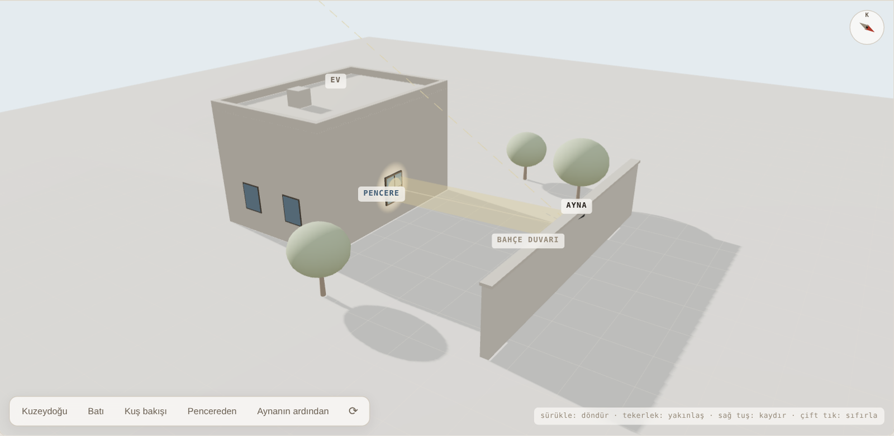
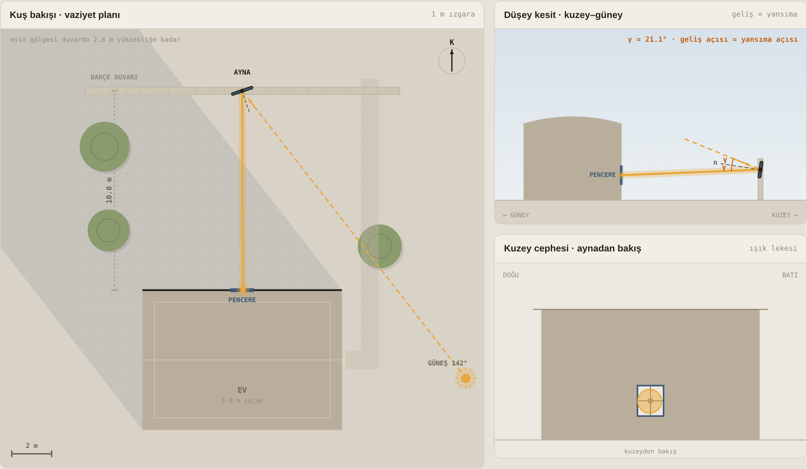
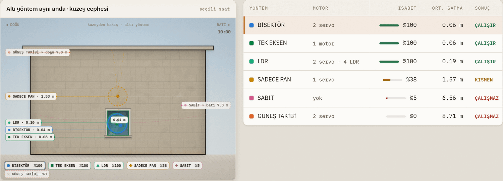

# Kuzey Işık Heliostatı

Kuzeye bakan bir pencereye, bahçe duvarına kurulan hareketli bir aynayla gün boyu
güneş ışığı taşıyan bir heliostat. **Ürgüp (Nevşehir)** için hesaplanmış geometri,
tarayıcıda çalışan interaktif bir simülasyon ve DS3231 + iki servo ile çalışan
Arduino kodu.



Evin kuzey cephesi hiç doğrudan güneş görmez. Cepheden 10 m kuzeydeki bahçe duvarına
konan bir ayna, gün boyunca dönerek güneşi sürekli aynı pencereye yansıtırsa bu
sorun çözülür. İşin tamamı tek bir kuralı doğru uygulamaya bakar.

## Temel kural

Ayna normali, güneş yönü ile hedef yönünün tam ortasını bölmelidir:

```
s = aynadan GÜNEŞE bakan birim vektör   (gün boyunca değişir)
t = aynadan PENCEREYE bakan birim vektör (sabit)

n = normalize(s + t)
```

Güneş gökyüzünde 15°/saat döner; ayna normali bunun yarısı kadar döner
(bu geometride 6.4–10.9°/saat). Aynayı güneşe doğrultmak **yanlıştır** — o zaman
ışık güneşe geri gider.

## Simülasyon

`docs/index.html` dosyasını tarayıcıda açın; internet gerekmez
(3B görünüm için `docs/three.min.js` yanında durur, WebGL yoksa 2B izometrik çizime düşer). GitHub Pages'i `/docs` klasöründen yayınlarsanız
doğrudan web'de de çalışır.



Simülasyon şunları veriyor:

- **Döndürülebilir 3B genel görünüm** (three.js: sürükle, yakınlaş, kamera ön ayarları,
  gerçek gölgeler, yansıyan ışık hüzmesi), **kuş bakışı vaziyet planı**, **düşey kesit**
  ve **kuzey cephesi** — dördü de aynı ana bağlı
- **Şimdi** düğmesi: Türkiye saatiyle canlı takip (sayfa bu modda açılır); tarih ve saat
  kaydırıcıları, günü hızlandırılmış oynatma (gece atlanır); grafiğe tıklayarak o saate gitme
- **Bağlantı** düğmesi: seçili tarih, saat, yöntem ve geometriyi taşıyan paylaşılabilir adres
  (örn. `index.html?g=355&t=540&m=gunes` — 21 Aralık 09:00, güneş takibi)
- Anlık servo açıları (PAN / TILT), geliş açısı, kosinüs verimi, pencereye giren güç
- Evin ve duvarın aynayı ne zaman gölgelediği
- Işık lekesinin cephede tam olarak nereye düştüğü ve pencereyi tutturup tutturmadığı
- Altı farklı yönlendirme yöntemini yan yana karşılaştırma

## Aynayı nereye çevirmeli? Altı yöntem

21 Aralık, aynı geometri. "İsabet", lekenin merkezinin 1.2 × 1.4 m'lik pencere
açıklığı içinde kaldığı zamanın oranı.



| Yöntem | Motor | İsabet | Ort. sapma | Sonuç |
|---|---|---:|---:|---|
| **Bisektör** `n = normalize(s + t)` | 2 servo | %100 | 0.06 m | Doğru yöntem |
| Tek eksen, sabit hız | 1 motor | %100 | 0.06 m | Gün içinde yeter, mevsimlik ayar ister |
| LDR kapalı döngü | 2 servo + 4 LDR | %100 | 0.19 m | Titrer; ince ayar olarak kullanılmalı |
| Sadece PAN döner | 1 servo | %38 | 1.57 m | Leke dikeyde kayar |
| Sabit ayna | — | %5 | 6.56 m | Günde birkaç dakika |
| Güneş takibi `n = s` | 2 servo | %0 | 8.71 m | Işığı güneşe geri yollar |

Klasik kutup ekseni + tam 7.5°/saat reçetesi bu hedef için **çalışmıyor**
(hata 1–2.8 m): hedef, kutup ekseni doğrultusunda değil. Ama optimize edilmiş
tek bir eğik eksen (azimut ≈ 180°, yükselti ≈ −26°, ≈ 11°/saat) lekeyi gün boyu
pencere içinde tutuyor. `tools/single_axis.py` bunu sayısal olarak gösteriyor.

## Yıl boyunca

Varsayılan geometride (10 m mesafe, ayna 2.20 m, pencere 1.80 m, 1 m² ayna,
%90 yansıtma, açık gökyüzü):

| Tarih | Ayna ışık alır | Süre | Ort. cos γ | Tepe güç |
|---|---|---:|---:|---:|
| 21 Aralık | 08:00 – 17:10 | 9.3 sa | %93.2 | 705 W |
| 21 Mart | 07:00 – 18:30 | 11.7 sa | %83.0 | 775 W |
| 21 Haziran | 09:10 – 16:20 | 7.3 sa | %75.6 | 719 W |

Sistem **kışın en verimli** — ışığa en çok o zaman ihtiyaç duyulur. Yazın duvarın
kendisi sabah ve akşam aynayı gölgeler, çünkü güneş kuzeydoğudan doğup
kuzeybatıdan batar.

## Donanım

| Parça | Seçim | Neden |
|---|---|---|
| Kontrolcü | Arduino Nano / Uno (veya ESP32) | AVR'nin 32-bit float'ı yeterli — bkz. `tools/float32_check.py` |
| Saat | DS3231 + CR2032 | ±2 ppm. DS1307 kullanmayın: 1 dk sapma = pencerede 4 cm |
| Motor | 2 × DS3218 / MG996R (metal dişli) | 1 m² ayna rüzgârda ciddi moment üretir |
| **Redüktör** | **3:1 – 4:1** | **Projenin en kritik parçası** (aşağıya bakın) |
| Besleme | 6 V / 5 A + 1000 µF | Servoları Arduino'dan beslemeyin |
| Ayna | 4 mm gümüş cam | Akrilik 1–2 yılda matlaşır ve bombeleşir |

### Neden redüktör şart?

Aynadaki **1° hata ışını 2° saptırır** → 10 m'de **35 cm** kayma. 1.2 m'lik bir
pencere ve ~1.1 m'lik leke için toplam hata bütçesi yaklaşık **0.3°**. Doğrudan
sürülen bir servo ~1° çözünürlük verir ve leke pencereden çıkar; 3:1 redüktör
bunu ~7 cm'e indirir.

Güneş nokta kaynak olmadığı için (0.53° açısal çap) leke, 10 m'de aynadan her
yönde 9 cm büyür: 1 m'lik ayna → 1.09 m'lik leke. Ayna büyütmek lekeyi
odaklamaz, büyütür.

## Kurulum

1. **Ölç.** Ayna ve pencere merkezinin birbirine göre konumunu üç eksende ölçün;
   `firmware/.../kuzey_isik_heliostat.ino` içindeki `MX/MY/MZ` ve `WX/WY/WZ` bunlar.
2. **Kuzeyi bul.** Sistemin tek zayıf noktası azimut sıfırıdır. Pusula manyetik
   kuzeyi gösterir (Ürgüp'te sapma ≈ +6° doğu); öğlen en kısa gölge yöntemi daha güvenlidir.
3. **Kalibre et.** Seri porttan `u1000` / `u2000` yazıp aynanın gerçek açısını ölçün,
   iki noktayı koda girin. Redüktör oranı bu ölçüme kendiliğinden gömülür.
4. **Doğrula.** Açık bir öğle vakti çalıştırın. Leke yana kaçıyorsa kuzey referansı,
   yukarı/aşağı kaçıyorsa TILT kalibrasyonu hatalıdır. Kayma miktarının yarısı,
   derece cinsinden aynanın hatasıdır.

Seri port komutları: `p<açı>` / `t<açı>` eksenleri sür, `u<µs>` / `v<µs>` ham
sinyal yaz, `k` park, `sYYYY,MM,DD,hh,mm,ss` saati ayarla.

## Güvenlik

Aynadan yansıyan ışık seyreltilmiş değildir: **aynaya doğrudan bakmak güneşe
bakmakla aynıdır.** Lekeyi oturma yerine değil, tavana veya açık renk bir duvara
düşürün. Odaya giren ~700 W ciddi bir ısı yüküdür; koyu renk yüzeyler saatler
içinde ısınır. Yumuşak limitleri (`PAN.minA` / `maxA`) mutlaka ayarlayın — bir
yazılım hatasında ışın komşunun penceresine ya da yola gitmemeli. 1 m² düz levha
100 km/sa rüzgârda ~500 N görür; konsol ve park mekanizması buna göre tasarlanmalı.

## Doğrulama

Güneş konumu NOAA algoritmasıyla hesaplanıyor ve **pvlib (NREL SPA)** referansına
karşı doğrulandı: yükseltide ≤ 0.016°, azimutta ≤ 0.007° sapma. Simülasyondaki
JavaScript ile `tools/` altındaki bağımsız Python hesabı, isabet oranlarında
birebir aynı sonucu veriyor (%100 / %38 / %5 / %0).

```bash
cd tools
python heliostat.py       # gün boyu açılar, gölgelenme, verim
python modes.py           # altı yöntem, lekenin cephedeki yeri
python single_axis.py     # en iyi tek eksen + sabit hız araması (numpy + scipy)
python float32_check.py   # AVR'de 32-bit float hatası ne kadar?
```

## Depo yapısı

```
docs/index.html      interaktif simülasyon (yanındaki three.min.js dışında bağımlılıksız)
docs/tasarim-kararlari.md   kararlar ve doğrulanmış sayılar
firmware/            Arduino kodu (RTClib + Servo)
tools/               Python referans hesapları
```

## Geometri notu

Simülasyon, bahçe duvarının cepheye paralel (doğu–batı) uzandığını varsayar.
Duvarınız eğikse aynanın güneş görebildiği saat aralığı kayar; koddaki
`sy >= -0.02f` kontrolünü duvarın gerçek normaline göre yazın.

## Lisans

MIT — bkz. [LICENSE](LICENSE).

---

**English summary:** A sun-tracking mirror (heliostat) that reflects daylight into a
north-facing window from a garden wall 10 m away, computed for Ürgüp, Cappadocia
(38.63°N, 34.91°E). Includes a dependency-free interactive browser simulation
(`docs/index.html`), Arduino firmware (DS3231 RTC + two servos, open-loop NOAA solar
position), and Python reference calculations validated against pvlib/NREL SPA.
The core rule is the bisector: `n = normalize(s + t)`.
